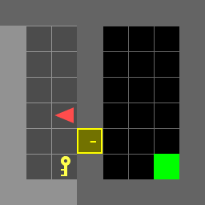
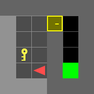
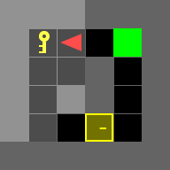
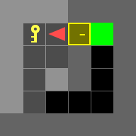
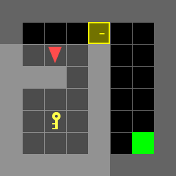
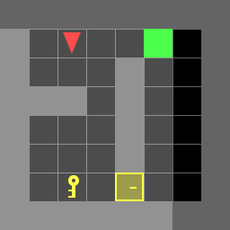
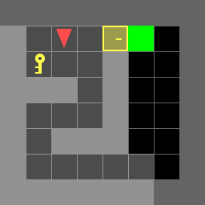

# Door-Key Problem 

## Overview
Markov Decision Processes using Dynammic programming for the Door-Key problems.
<p align="center">
</br>
</p>

There are results for 7 test scenes 

| doorkey-5x5-normal |
|:----------------:|
|  |

| doorkey-6x6-normal   | doorkey-6x6-direct | doorkey-6x6-shortcut |
|:----------------:|:------------------:|:----------------:|
|  |  ||

| doorkey-8x8-normal   | doorkey-8x8-direct | doorkey-8x8-shortcut |
|:----------------:|:------------------:|:----------------:|
|  |  ||

## Installation

- Install [gym-minigrid](https://github.com/maximecb/gym-minigrid)
- Install dependencies
```bash
pip install -r requirements.txt
```

## Instruction
### 1. doorkey.py
You will need to modify **doorkey.py** as the main entrance.

### 2. utils.py
You might find some useful tools in utils.py
- **step()**: Move your agent
- **generate_random_env()**: Generate a random environment for debugging
- **load_env()**: Load the test environments
- **save_env()**: Save the environment for reproducing results
- **plot_env()**: For a quick visualization of your current env, including: agent, key, door, and the goal
- **draw_gif_from_seq()**: Draw and save a gif image from a given action sequence. **Please notice that you have to submit the gif!**

### 3. example.py
The example.py shows you how to interact with the utilities in utils.py, and also gives you some examples of interacting with gym-minigrid directly.

## Funtions

- **BFS**: gets the shortest cost from all possible states to the given state. returns an array with cooresponding costs and a tree having child nodes for that shortest path.

- **get_shortest_path()**: returns the optimal controls which passes throught the best pickup position

- **controls_to_sequence()**: takes the optimal con trols and returns the optimal sequence. Note: Control is different from sequence here

- **get_pickup_positions()**: returns all the possible pickup positions

- **get_best_pickup_position()**: returns best pickup position that minimizes cost from start to key and key to door

- **Start_To_Goal_direct()**: computes cost and policy for direct reach if possible

- **Start_To_Goal_viaDoor()**: computes cost and policy for path via Door

## How to run the code?

Just change the variable env_name to the desired environment. It should be located in ./env folder and must have extension .env.
